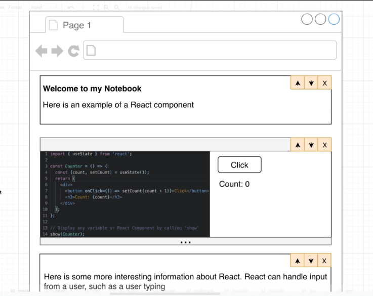
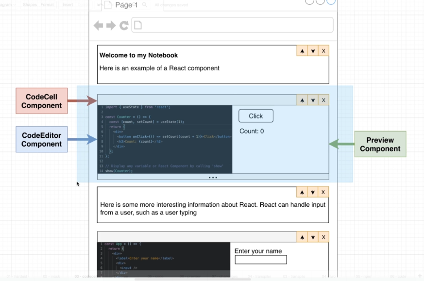
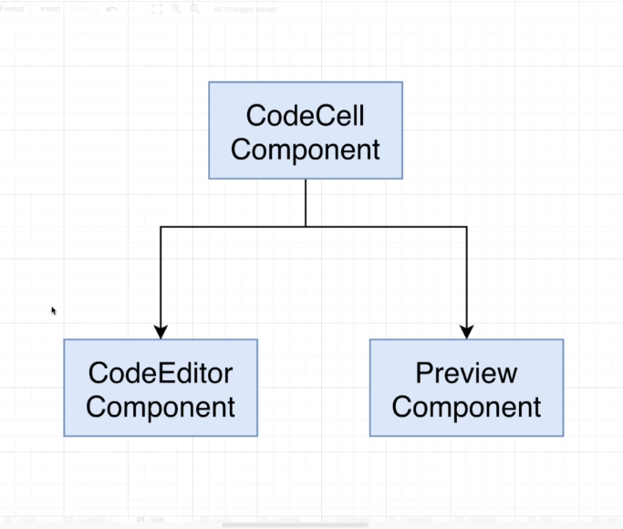
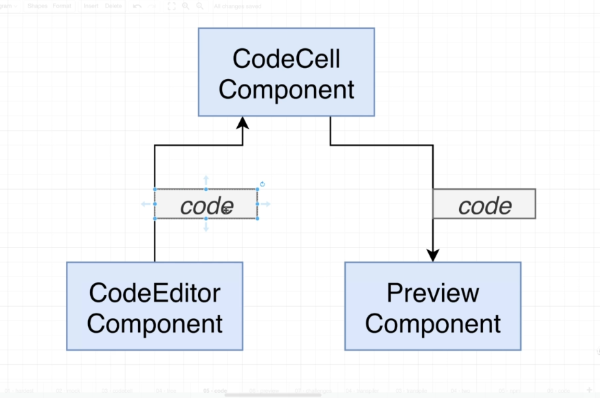
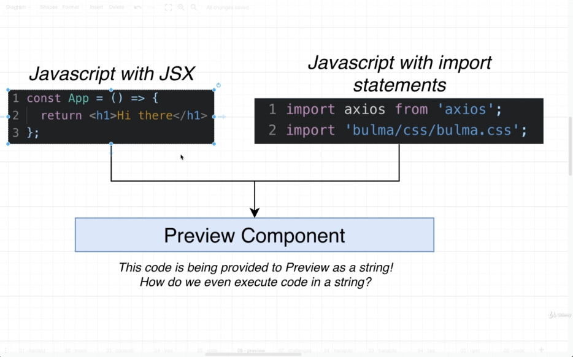

# What're we building?

A CLI to launch an interactive development environment for writing + documenting code

- This is a big app with a lot of pieces!

- Where to start ?

- Let's tackle the **hardest part first** - executing user's code in a preview window

## Design

### Prototype

### Component Separation

### Component Hierarchy

### Data flow

### The Big challenge

## Really Big Challenges

- Code will be provided to Preview as a **string**. We have to execute it safely

- This code might have advanced JS syntax in it (like JSX) that your browser can't execute

- The code might have import statements for other JS files or CSS. We have to deal with those import statements before executing the code.
