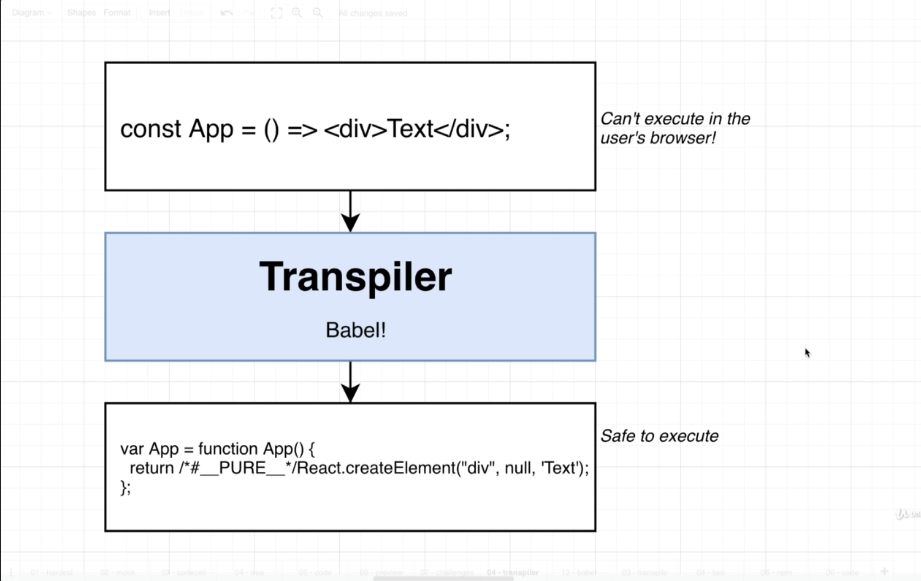
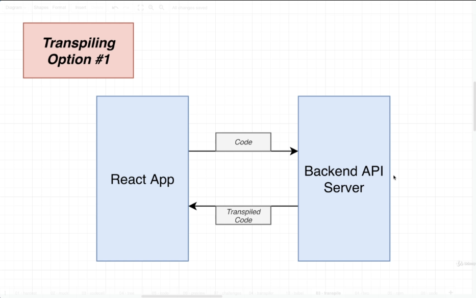
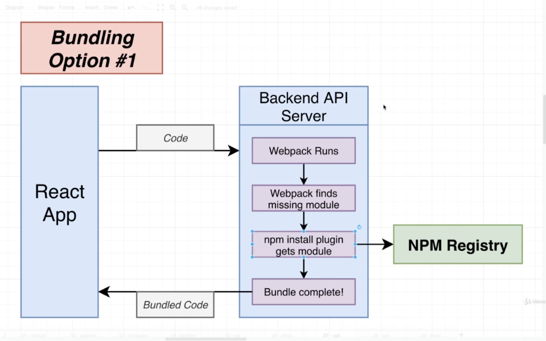
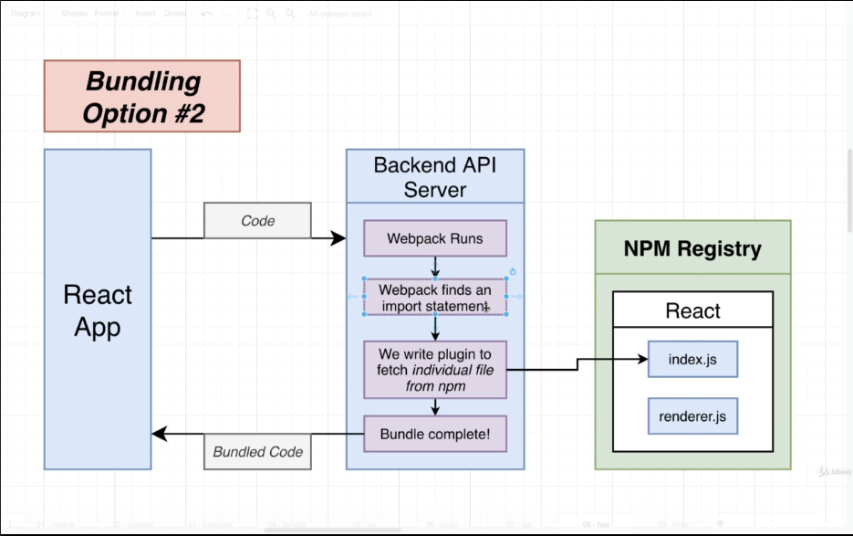
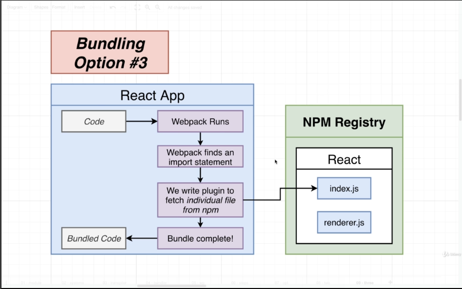
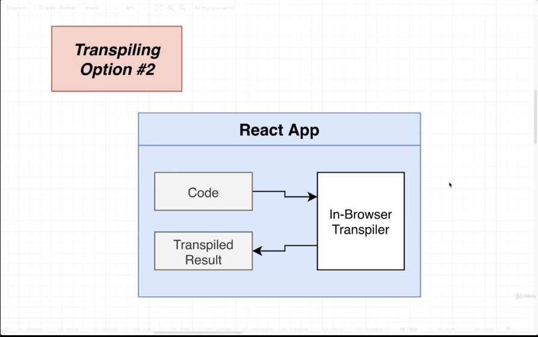
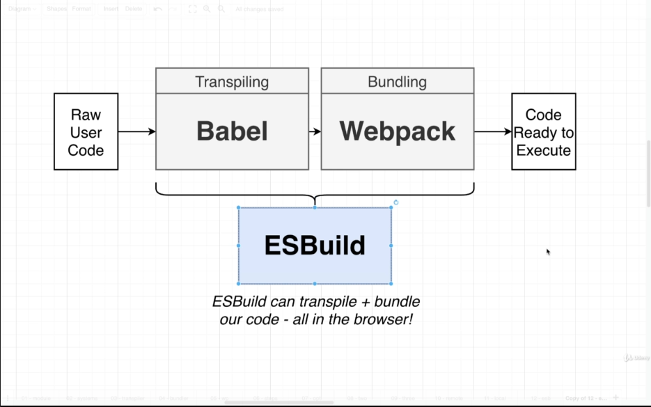

# Code Transpiling in the Browser

Out of these three different challenges, we're going to work on the second one first

- This code might have advanced JS syntax in it (like JSX) that your browser can't execute.

## Transpiler

### Babel



Support for browsers that does not support modern syntax

Problem#2 would be solved if we could get Babel working in our React app

- To get some inspiration on how to do this, let's take a look at two existing apps online and see how they use babel

- codepen.io
- babejs.io

## Transpiling Option 1

### Remote Transpiling



## Module Systems

### Javascript Modules

Javascript file that makes some values available to other files and/or consumes values from other files

- message.js

```
export default 'Hello there!';
```

- index.js

```
import message from './message;

console.log(message);
```

### Javascript Module Systems

There are several different module systems

- AMD

```
define(['dep'], (dep) => {});
```

- common js

```
require()
```

```
module.exports
```

- ES Modules

```
import a from 'a';
```

```
export default 123;
```

A bundler like **Webpack** will take multiple different modules and combine them all together and somehow link them **into one single file**

## Bundler

- Read the contents of the **entry file (index.js)**

- **Automatically** found all the different require/import/export statements

- **Automatically** found all the modules on our hard drives

- Linked these files together into a single output file with all values being correctly communicated around

To solve Problem#3 we want to rather than trying to find some module on our hard drive, whenever a user writes out a important statement, we want to make sure that our slightly different bundler will attempt to instead **find a module that a user imports directly from NPM**.

We want a bundler that works **slightly** differently

## Options for Bundling

### Bundling Option 1: Download files



### Bundling Option 2: Bundling on API



### Bundling Option 3: Bundling on Client



## So Which Approach

**Remote**

- We can cache downloaded NPM modules to bundle code faster

- Will work better for users with slow devices or limited internet connections

**Local**

- Removes an extra request to the API, faster code execution

- We don't have to maintain an API server

- Less complexity - no moving code



One small problem...
Webpack doesn't work in the browser...

## A Webpack Replacement



We can take some arbitrary code, transpile it, bundle it and then get some actual result that we can then execute
