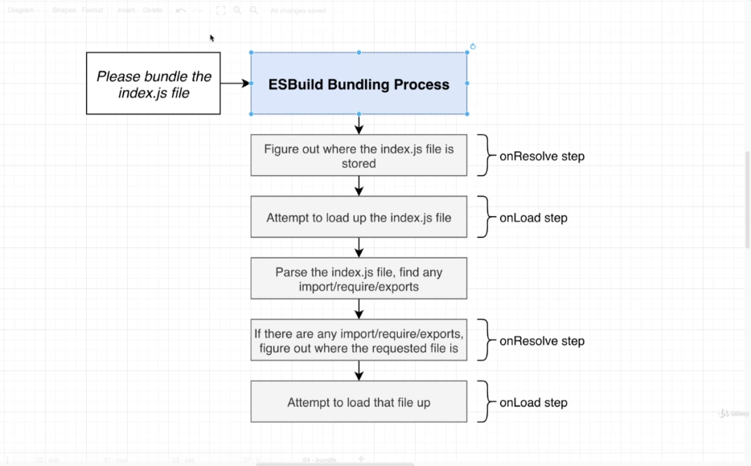

## Npm

## Get URL to download source code for React

### Download module locally

```
npm view react dist.tarball
```

A link that we can navigate to to download an archive that contains all the source code for react.

Essentially what you are downloading when you run `npm install react` command.

extract has a **package** directory with a `package.json` file in it which has a **main** field `main: index.js` for the file to load during import

### Get module into browser

If I run a `fetch('https://registry.npmjs.org/react/-/react-17.0.1.tgz')` inside the browser of `localhost:3000` tab I get an error and this is exactly why we cannot reach out directly to NPM when trying to fetch these dependencies.

Your browser is going to send along some information in that request describing what the current URL of the browser is, in this case `localhost:3000`

Unfortunately, the NPM registry is configured to reject any download request if a user is at some URL probablyl besided `npmjs.org`

**CORS error**

### UNPKG

Unpkg.com acts like a proxy to npm

If we make a request to that URL:

```
https://unpkg.com/react
```

we will automatically be directed to the current version of React and to the main entrypoint of that `package.json` package

## Deep Dive on Bundling

### onResolve step

There is an onResolve step that is used to figure out what the **actual path** to a particular file inside of a plugin is, if we define an onResolve function to override the default behavior.

### onLoad step

Is used to actually **load up a file** of the file system. If we define the onLoad callback inside of a plugin, we are going to override esbuild's natural process of trying to access the file system.

Only by overriding these two functions we are going to be able to run or create a bundle inside the browser.



## Filters and Namespaces

### Filters

The object with the filter field is a regular expression. This is how **we can control when on resolve and when on load are actually executed**.

We might have different versions of onResolve and onLoad that should run with different kinds of files (e.g js, ts, css).

```
build.onResolve({ filter: /.*/ }, async (args: any) => {
  console.log('onResole', args);
  return { path: args.path, namespace: 'a' };
});
```

### Namespaces

Similar to filters, apply onResolve and onLoad functions to only those specific files with that namespace
