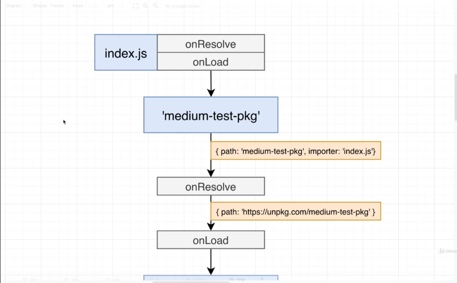

# Dynamic Fetching and Loading of NPM Modules



## Traversing Paths in the Browser

(path, baseURL)

```
new URL('./utils', 'https://unpkg.com/medium-test-pkg/');
```

The href returns the relative path
