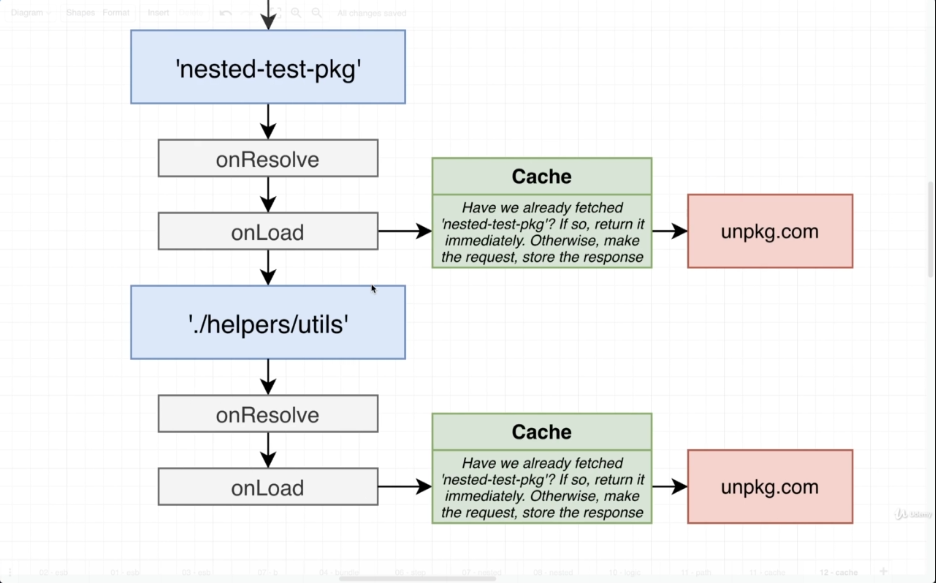
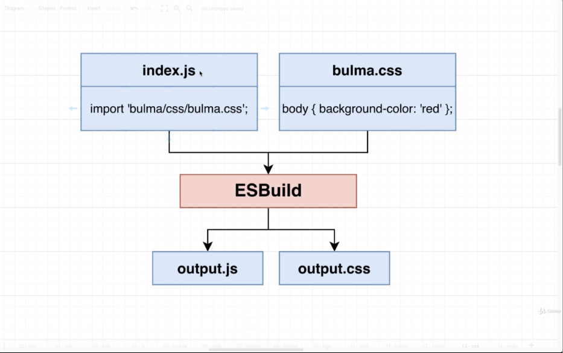

# Caching for Big Performance Gains

## Implementing a Caching Layer



If we store all packages in LocalStorage we might saving to much information, and might be deleted from LocalStorage

We'll make use of **IndexedDB**, in which we can store a lot more information inside

Use of the library **localforage**

```
const cachedResult = await fileCache.getItem<esbuild.OnLoadResult>(
  args.path
);
```

## Bundling CSS with esbuild



If we were running esbuild from e.g. command line or from a nodejs environment and esbuild could write some output file, it would split out two output js and css files

But esbuild does not have a filesystem to work with in the browser, it cannot deal with css files at all

We take the content of the css file and append to the head as a style element
