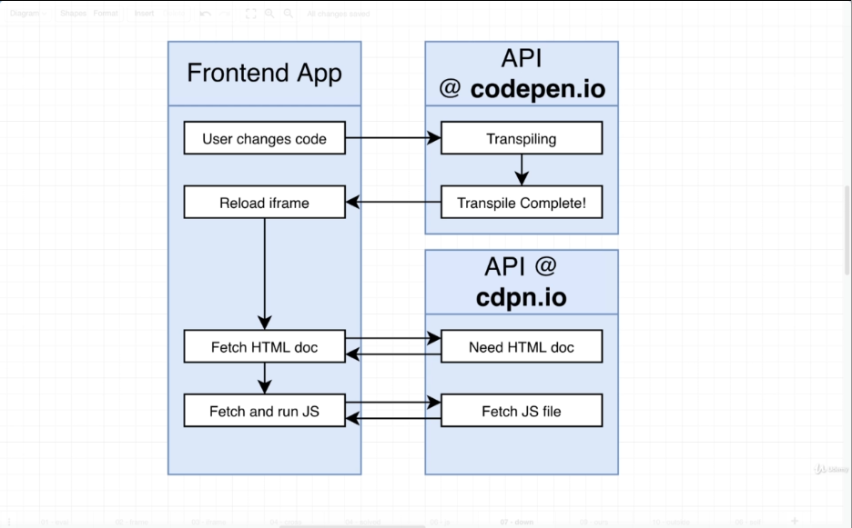

# Safely Handling Untrusted Code Execution

We have solved the Really Big Challenges # 2 (executing JSX in browser), #3 (support include statements for JS/CSS files)

Now we are going to talk about code execution inside the browser Big Challenge # 1

- Take the output of the bundle and execute it **safely**

## Executing User Code

One possible solution would be to use `eval` function in a try catch block

```
try {
  eval(result.outputFiles[0].text);
} catch (err) {
  console.log(err);
}
```

one problem with that is when we use async code

```
setTimeout(() => {
  console.lfdsags();
}, 100);

```

When we do a try catch around some block of code, that code is executed and in that instant that it is executed, we watch for an error.

As soon as that code is executed, we then exit out of the try catch block and flow continues as usual

**There is no try catch around that inner function** inside the setTimeout

So if the user ever write some kind of asynchronous code inside their application and it throws an error, everything crashes

## Big Issues with Code Execution

### Considerations Around Code Execution

- User-provided code might throw errors and cause our program to crash

- User-provided code might mutate the DOM, causing our program to crash

```
document.body.innerHTML = '';
```

- A user might accidentally run code provided by another malicious user

A malicious user can include code that sends the auth cookie to it's server and impersonates the actual user

or add an event listener for inputs e.g. login pass and send that information to malicious server

## Displaying IFrames

We use iframes for embedding one document into another

By embedding iframes there are two different contexts in which we can run JavaScript, we can run JS in the context of the **parent** frame or can run JS in the context of the **child** iframe

Child iframe does not have any visibility to the properties of the parent and vice versa.

We can enable some amount of communication between these two different context

## Crossing Context

With the current settings we have access to the parent iframe though by referencing the `parent` property inside `test.html` execution context

If `window.a = 1` in parent then in child there is the `parent.a` which equals to `1`

or `window.b = 2` in child I can reach from parent with:

```
document.querySelector('iframe').contentWindow.b
```

## Sandboxing an IFrame

Direct access between frames is allowed when...

- The iframe element does not have a 'sandbox' property, or has a 'sandbox="allow-same-origin"' property

AND

We fetch the parent HTML doc and the frame HTML doc from the **exact same**

- Domain
- Port
- Protocol (http vs https)

## The Full flow of Codepen



## Middle Ground Approach

Implementation with no extra server to fetch HTML document and we isolate the iframe context using the `sandbox=""` property.

The one downside is we lose the ability to access some in browser features like local storage and cookies

## IFrames with SrcDocs

```
<iframe sandbox="" srcDoc={html} />

const html = `
<h1>Local HTML doc</h1>
`;
```

## IFrames: Allow executing code

```
const html = `
  <script>
    ${code}
  </script>
`;

<iframe sandbox="allow-scripts" srcDoc={html} />

```

## Indirect Communication Between Frames

In application context we can add an event listener through the console

```
window.addEventListener('message', (event) => console.log(event), false)
```

and in the textarea that the code will be bundled, transpiled and executed in the frame we can execute:

```
parent.postMessage('hello there', '*');
```

This is thought of as still being secure in nature because it's a lot harder for some code running inside the iFrame to try to reach out to the parent and tr to access direct values such as set up event listeners, or cannot read values like cookies / local storage

won't work if we do:

```
parent.postMessage('hello there', 'google.com');
```

because the message was interpreted by a parent of google.com

We're going to communicate all of our bundled code through that post message
